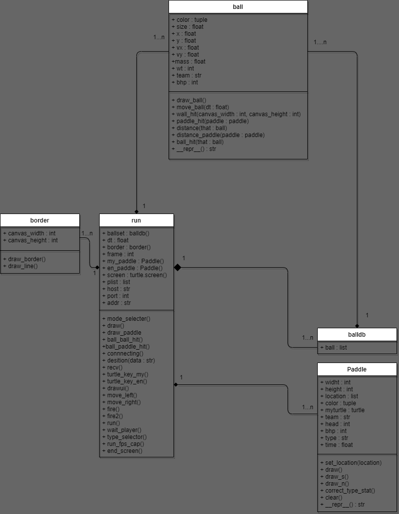

# THE BALL HELL

This is a game about shooting each other with ball will totally very deep lore.

There will be a prompt showing you what to put in the box.

## Character
There are currently 2 Shape square and triangle each shape offer difference stat and move.
- Triangle :
  - Hp : 10
  - Normal atk  : 5
  - Special atk : 10
- Square :
  - Hp : 10
  - Normal atk  : 1x3
  - Special atk : 5x5

## Game Mode
There are 2 type of mode to play online multiplayer or Offline multiplayer.
- Online :
  - Need to portforward your ip from the router or use the same network connection
- Offline :
  - 1 v 1 with your friend localy on your own pc
    - use WASD for Blue and arrow keys for Red

## Control
The control are simple
- Blue Team :
  - Movement key :
    - A : to move left
    - D : to move right
  - Attack key :
    - S : Normal Attack
    - W : Special Attack
- Red Team (ONLY FOR OFFLINE MODE):
  - Movement key :
    - Left Arrow  : to move left
    - Right Arrow : to move right
  - Attack key :
    - Down Arrow  : Normal Attack
    - Up Arrow    : Special Attack

## Installation
Here is the installation guide.
- clone this git repository into your machine
- open the play.py
- put in your ipv4 in useripv4 (You can follow this guide below to get your ipv4)
    - Win 10/11
        - Press Win + R and type cmd then press OK
        - in cmd type in *ipconfig*
        - look for the line that say *IPv4 Address* it should have a number like *192.168.x.xxx* that is your ipv4
    - Mac
        - Open the Apple menu and select System Settings
        - Click Network in the left panel
        - Select Wi-Fi or Ethernet
        - Click Details next to the network you're connected to
        - Scroll down to see your Mac's local IP address

## Online Multiplayer Setup
You can chose between portforwarding or use a local network(same wifi connection)
- Portforward
    - Hosting
      - open your cmd and type in
      -     ipconfig
      - there should be a line call *Default Gateway* copy the ip in that line
      - open your browser and paste the ip onto the search bar
      - login to your wifi router if you don't know the password try look at the back of the router
      - typically the login username and password is *admin* and *password*.
      - find a tab call portforwarding (IT NOT THE SAME FOR EVERY ROUTER)
      - put in your ipv4 and port that you are using in the play.py (default is 25556)
      - if you have 2 port input slot put the port you are currently using into all of the slot.
      - select *TCP/UDP* and press done/ok
      - open another tab on your browser and search my ip you will get yourself a *public ip* (KEEP IT SECRET DO NOT SHARE WITH WHO YOU DON't TRUST)
      - send your friend your *public ip* and the port you are using
      - goto play.py and run the program press 1 and wait for your friend
      - if your friend join follow the instruction on a pop-up window
    - Joining
      - wait for your friend to setup the server
      - if you got your friend public ip and port run play.py
      - press 2 and hit *OK*
      - input your friend public ip and press OK
      - then input the port and press OK
      - now you are playing together and follow the instruction on a pop-up window
- Local
    - Hosting
          - run play.py and press 1
    - Joining
          - make sure you are using the same wifi or enternet as the Hosting device
          - run play.py and press 2
          - input your friend ipv4 and press OK
          - input your friend port and press OK

## Project design and implementation

- ### class description
    - ball : keep the data of the ball and a ball's basic function
    - paddle : use as the player and keep the data of the player
    - balldb : keep the data of every balls in the screen
    - border : create a border and keep the border data
    - run : run all the game and networking from here
- ### Interaction of each class
    - class balldb keep the object of class ball in it
    - class run run all ball in class balldb and also paddle and border
- ### Extension and Modification from the base code
    - make the ball destroy each other instead boucing of each other
    - make the paddle able to move only left and right
    - make the paddle be able to shoot the ball from it
    - make the border portrait instead of landscape
    - the game is lock at 120 fps to make more stability with each other in Online
    - now there is 2 paddles with different control
## Bugs
There is some bug regarding the online multiplayer with very bad internet connection.
It cause a little bit of problem such as desync and a bit of delay on the death screen.

## My Rating : 95
I am impress by how much i learn from making this but there still a room of improvement such as more charactor with more attack type or a better coding style.
The UI need a lot more improvement. And graphic design is my passion (Totally).

      

